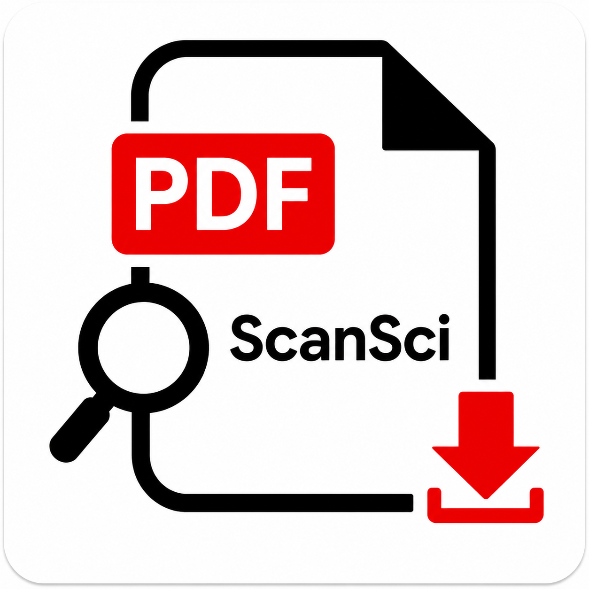

# scansci-pdf

ScanSci 学术文献全家桶 plugin:大清单嗅探分类 + 全场景下载检索排障,携带 scansci-pdf MCP server(stdio)。

## 组件

**Skills(2 个,按意图拆分):**

| Skill | 场景 |
|---|---|
| `scansci-sort` | 大清单(数百篇+)分类摸底:OA / Sci-Hub / 需机构,嗅探优先不下载,产出分桶队列 |
| `scansci-pdf` | 其余一切:单篇/批量下载、检索引文、机构渠道(Elsevier API/WebVPN/CARSI)、排障(本插件已内置;用户目录若有同名 skill 则优先) |

**Commands(4 个,快捷入口,不占上下文):**

| Command | 用途 |
|---|---|
| `/scansci:sort <文件>` | 嗅探分类摸底,产出报告+分桶队列 |
| `/scansci:paper <DOI> [策略]` | 单篇下载 |
| `/scansci:batch <文件>` | 批量下载(自动分批) |
| `/scansci:doctor <症状>` | 诊断排障 |

## 依赖

- `scansci-pdf` CLI 在 PATH(`pip install -e <本仓库>` 或 `uv pip install -e .`;插件清单不负责安装 Python CLI,此为前置条件)
- MCP server 由 plugin 自动注册:`scansci-pdf run`(stdio),无需手动配置
- 可选:`scansci-find` CLI(`pip install scansci-find`)——Find 系深度检索工具(plan/estimate/find/smoke/calibrate 等)依赖它;未安装时主 skill 会自动降级到本地工具链

## 安装

Settings → Plugin Management → Discover → 添加本地目录(本目录)→ 启用 scansci-pdf。

## 跨 agent 共享

- **Codex App**：使用仓库根目录的 `.codex-plugin/plugin.json`、`.mcp.json` 和 `skills/`；本目录保留为 ZCode 专属适配层。
- **Claude Code**：使用仓库内 `.claude/skills/` 与标准 MCP 配置；也可以用 shared-skill-installer 同步 `skills/` 下两个 skill。
- **ZCode**：继续使用本目录的 `.zcode-plugin/`、commands、skills 和 marketplace 配置。
